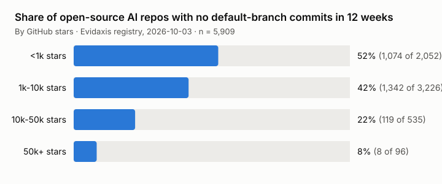

# Popular but dormant: commit activity of open-source AI repositories by star band

*Evidaxis research note · snapshot 2026-10-03 · data and code CC0-1.0*

One in five open-source AI repositories with 10,000 or more GitHub stars had no commits on
its default branch in the 12 weeks to 3 October 2026: **127 of 631** (20.1%). Every one of
those zeros was re-checked against the GitHub commits API on 4 October 2026.



| Stars | Repositories | No commits in 12 weeks | Share | Declining 26-week commit trend |
|---|---:|---:|---:|---:|
| under 1k | 2,052 | 1,074 | 52.3% | 32.7% |
| 1k to 10k | 3,226 | 1,342 | 41.6% | 35.7% |
| 10k to 50k | 535 | 119 | 22.2% | 46.4% |
| 50k and more | 96 | 8 | 8.3% | 52.1% |

Dormancy falls with popularity, yet a fifth of the 10k+ tier is idle, and about half of
the most-starred repositories show a falling commit trend. Star counts alone say little
about whether a project is still maintained.

## Population

The Evidaxis registry of 2026-10-03: 5,910 open-source AI systems with a public GitHub
repository, selected by a published, automated eligibility rule applied to a monthly
census of public repositories, not by editorial choice. All 5,910 carry the commit
measure used here; one is excluded (see Verification), leaving 5,909. This is the
registered population, not the smaller set of 212 systems that Evidaxis scores on all of
its axes.

## Definitions

- **No commits in 12 weeks:** `recent_weekly_commits = 0`, where `recent_weekly_commits` is
  the mean of the last 12 weekly totals from GitHub `GET /repos/{repo}/stats/commit_activity`
  (default branch).
- **Declining 26-week trend:** the OLS slope of log(1 + weekly commits) over the last 26
  weeks is below zero (`axes.github_commit_velocity.slope` in the snapshot).
- **Stars:** `stargazers_count` at collection time (`stars_not_scored`; Evidaxis does not
  score stars).

## Verification

GitHub's statistics endpoint can return all-zero weeks for an active repository. All 128
zero-activity repositories with 10k+ stars were re-checked with
`GET /repos/{repo}/commits?since=2026-07-11` on 4 October 2026: 127 confirmed, one false
zero (an organisation-owned repository with 100+ commits in the window), excluded from
both numerator and denominator (`verification.csv`). A random sample of 80 zero-activity
repositories across all bands gave 79 true zeros and one false zero, so the lower-band
shares may be overstated by about one percentage point. The collector now refuses such
false zeros at capture time (`governance/ERRATUM-2026-10-04-commit-activity-false-zero.md`).

## Limits

- Default branch only: work on long-lived non-default branches or in forks is not counted.
- Twelve weeks is a short window; release-driven projects can pause for longer and resume.
- A dormant repository may be finished and stable rather than abandoned; the measure
  records activity, not intent or quality.
- Organisation-owned repositories are named in `verification.csv`; repositories owned by
  personal accounts are listed by Evidaxis entity id only (the project publishes systems,
  never people).

## Reproduce

```
python3 analysis.py                  # bands.csv and chart.svg from the archived snapshot
GITHUB_TOKEN=... python3 analysis.py --verify-live   # also re-checks the 10k+ zeros
python3 analysis.py --snapshot <path to the Hugging Face 2026-10-03/snapshot.json>
```

Standard library only. The archived snapshot is `data/snapshots/2026-10-03/snapshot.json`
in this repository; its person-free projection is published in the Hugging Face dataset
[`evidaxis/momentum-snapshots`](https://huggingface.co/datasets/evidaxis/momentum-snapshots)
under `2026-10-03/`.

## Cite

Evidaxis (2026). *Popular but dormant: commit activity of open-source AI repositories by
star band.* Research note, snapshot 2026-10-03. https://github.com/evidaxis/evidaxis/tree/main/research/2026-10-popular-but-dormant ·
Evidaxis in FAIRsharing: https://doi.org/10.25504/FAIRsharing.70181b

Questions and corrections: hello@evidaxis.org
